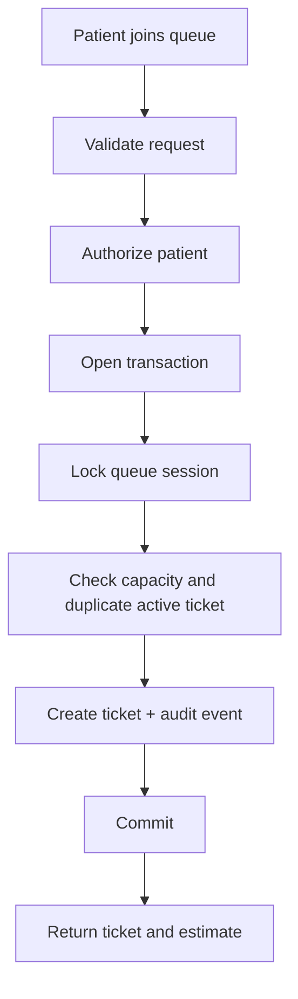

# Maw3id production architecture

Maw3id should be built as a modular monolith first. The domain is complex enough to require clean boundaries, but not large enough for microservices.

## Recommended stack

| Layer | Choice | Reason |
| --- | --- | --- |
| Frontend | React + TypeScript | Existing code already uses React; strong map ecosystem; lower delivery risk for V1 |
| API | Node.js + TypeScript + Express | Simple deployment path and team-friendly |
| Database | PostgreSQL | Strong consistency for queue correctness |
| ORM/migrations | Prisma or Drizzle | Typed schema, repeatable migrations |
| Validation | Zod | Runtime validation at API boundaries |
| Maps | Leaflet or MapLibre | Works well for Moroccan city/cabinet discovery |
| Realtime V1 | Polling or Server-Sent Events | Simpler and reliable enough for queue status |
| Realtime later | WebSockets | Useful after V1 workflows stabilize |
| Observability | structured logs + metrics + error tracking | Needed for production operation |

## Frontend decision: React, not Angular

React + TypeScript is the locked V1 frontend choice.

Angular is a serious enterprise framework, but switching now would mostly buy ceremony and delay. Maw3id's hard problems are queue correctness, auth, authorization, auditability, privacy, and real-time operational truth. React is already present in the repo and is strong enough for the patient app, doctor dashboard, and map experience.

Reopen this decision only if a real constraint appears, such as a required enterprise Angular team, a government/clinic integration mandate, or a maintained Angular codebase we must extend.

## Backend modules

| Module | Responsibility |
| --- | --- |
| Identity | users, sessions, roles, password reset, account verification |
| Cabinets | verified locations, cities, coordinates, insurance/support metadata |
| Doctors | specialty, profile, verification, staff assignments |
| Schedules | opening hours, service windows, holidays, ad-hoc closures |
| Queue | queue sessions, tickets, state transitions, wait estimates |
| Search | specialty/date/location filtering and map payloads |
| Audit | immutable security and operational event log |
| Observability | health checks, request IDs, logs, metrics |

Authentication and authorization decisions are specified in [AUTH_AND_SECURITY.md](./AUTH_AND_SECURITY.md).

## Scale and resilience model

Start as a modular monolith with stateless API instances. Scale API and background workers horizontally behind a load balancer while PostgreSQL remains the correctness authority.

| Concern | Design |
| --- | --- |
| Queue writes | PostgreSQL primary, short transactions, row locks, constraints, idempotency keys |
| Public map reads | PostGIS indexes; bounded cache with explicit freshness timestamps |
| Realtime updates | Server-Sent Events with reconnect cursor; polling fallback |
| Notifications | Transactional outbox plus idempotent workers and retry/dead-letter policy |
| Rate limits | Shared Redis-backed counters in production; stricter auth and queue limits |
| Failure isolation | Timeouts, bounded retries with jitter, circuit breakers around external providers |
| Deployments | Backward-compatible migrations, rolling deploys, feature flags, fast rollback |
| Recovery | Automated encrypted backups plus regularly tested point-in-time restore |
| Observability | Structured logs, traces, RED metrics, business metrics, SLO-based alerts |

Redis, caches, search indexes, and realtime channels may improve speed but must never decide ticket order or capacity. If they fail, queue correctness remains intact and the UI degrades to fresh reads or an explicit `unknown` state.

## Critical edge-case policy

| Scenario | System behavior |
| --- | --- |
| Patient double-clicks or retries after timeout | Same idempotency key returns the original result; no duplicate ticket |
| Two patients take the last place | Queue-session lock serializes requests; exactly one succeeds |
| Staff pauses while a patient joins | Transaction ordering determines one auditable outcome; UI refreshes authoritative state |
| API crashes after database commit | Retry resolves through idempotency record; notifications resume from outbox |
| Cabinet loses internet | Existing local workflow continues operationally; public state becomes stale then `unknown` |
| Realtime connection drops | Client reconnects from an event version or falls back to polling |
| Read replica/cache lags | Writes and own-ticket reads use primary; public data shows freshness |
| SMS/maps provider fails | Circuit breaker contains failure; core queue operations stay available |
| Morocco timezone rules change | Store instants in UTC and business timezone as `Africa/Casablanca`; never trust device time |
| GPS permission denied/spoofed | Manual location search works; cabinet coordinates remain platform-verified |
| Walk-in and online arrivals collide | Both use the same queue session and transactional ticket allocator |

## Request flow for joining a queue

## Queue correctness design

The queue engine must use database constraints and transactions, not memory counters.

Required database protections:

1. unique active ticket per patient per queue session;
2. unique ticket number per queue session;
3. queue session capacity checked inside the same transaction as ticket creation;
4. row-level lock on the queue session when allocating ticket numbers;
5. audit event inserted in the same transaction as the state change.

## Nearby doctors map

The map shows verified cabinet locations, not a doctor's private live position.

Search inputs:

1. patient location from browser permission, or manual city/neighborhood;
2. specialty;
3. date/service window;
4. insurance filters later;
5. open/accepting filters.

Search output:

1. doctor/cabinet identity;
2. specialty;
3. verified address and coordinates;
4. queue status;
5. estimated waiting range;
6. last updated timestamp;
7. whether new tickets are accepted.

Privacy rule: public map results must not include patient names, phone numbers, exact queue members, or sensitive medical details.

## Deployment environments

| Environment | Purpose |
| --- | --- |
| local | developer testing with seeded demo data |
| test | automated tests and CI |
| staging | production-like environment for clinic pilot rehearsal |
| production | real users and verified clinics only |

## Production readiness gates

Maw3id should not be piloted in a real cabinet until these pass:

1. automated tests for queue capacity, duplicate tickets, and state transitions;
2. auth and authorization tests for patient/doctor/secretary/admin boundaries;
3. no hardcoded secrets;
4. migrations are repeatable from an empty database;
5. map endpoint excludes private patient data;
6. health endpoint works without database leakage;
7. errors are structured and do not expose stack traces in production;
8. basic monitoring and alerting exist;
9. backup/restore procedure is documented;
10. staff workflow has been tested with realistic walk-in scenarios.
