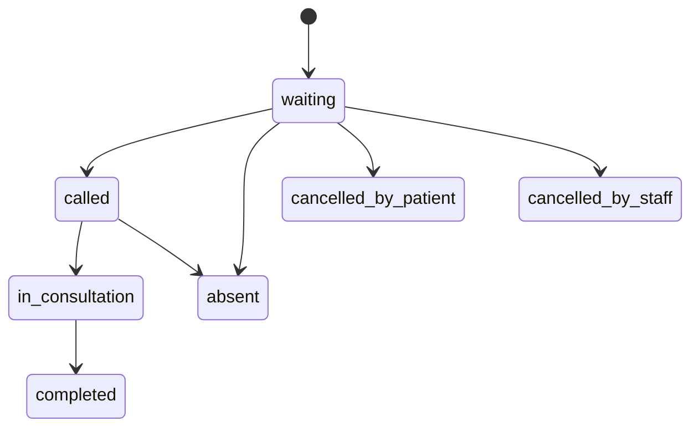

# Queue engine design

The queue engine is the heart of Maw3id. If it is wrong, the map and dashboards become misleading.

## Queue session

A queue session represents one doctor serving patients at one cabinet during one date/time window.

Example:

```text
doctor: Dr. Amina
cabinet: Agdal, Rabat
date: 2026-08-17
window: morning
capacity: 25
state: open
```

## Ticket lifecycle



## Position calculation

Position should be computed from active tickets in the same queue session.

Tickets that are completed, absent, or cancelled are not counted as waiting ahead.

V1 can calculate position with a database query. Denormalized counters can be added later only if measurement shows it is needed.

## Wait estimation

Start simple:

```text
estimated_wait_minutes = patients_ahead * average_consultation_minutes
```

The default average can be configured per specialty or per doctor. Later, the system can learn from historical completed tickets.

## Walk-ins and online patients

The queue must support both:

1. online tickets created by patients;
2. walk-in tickets created by doctor staff.

Both ticket sources enter the same queue session and must obey the same capacity and numbering rules.

## Audit events

Every important queue action creates an audit event:

| Action | Required audit fields |
| --- | --- |
| create ticket | actor, patient, queue session, ticket number, source |
| call ticket | actor, old state, new state, timestamp |
| mark absent | actor, old state, new state, reason optional |
| complete ticket | actor, old state, new state, timestamp |
| pause/open/close queue | actor, old state, new state, reason optional |

Audit events are append-only. They are not edited after creation.
